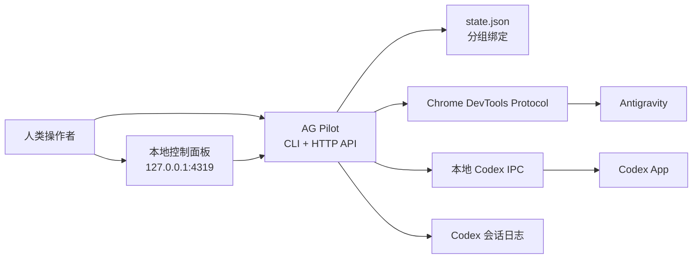

# AG Pilot

> 让 Antigravity 和 Codex 直接对话。不复制，不粘贴，只做受监督的本地路由。

[English](README.md) | **中文**

[](https://github.com/sefuzhou770801-hub/ag-pilot/actions)
[](#为什么需要桥接)
[](#环境要求)
[](LICENSE)

AG Pilot 是一个**本地 AI Agent 通信桥梁**，给同时跑 Antigravity 和 Codex 的人用。把一个 Antigravity 对话绑定到一个 Codex 线程，然后通过 CDP 和本地 IPC 路由消息——不再需要用剪贴板当中间件。

## 演示


在控制面板点击分组标签，两边同时跟着切换：

- Antigravity 通过真实的 CDP 鼠标事件选中绑定的 Antigravity 对话。
- Codex 通过本地 IPC 打开绑定的线程。
- 面板始终显示固定的分组绑定，而不是当前碰巧聚焦的窗口。

## 为什么需要桥接

两个 Agent 协作时，最脆弱的不是模型，是人工复制粘贴的循环。

AG Pilot 把这个循环变成一个小型本地控制面：

- **显式分组绑定**：每个分组拥有一个 Antigravity 对话和一个 Codex 线程。
- **真实 Antigravity 选择**：CDP 发送真实鼠标事件，不是脆弱的 DOM 点击。
- **安全路由**：发送和读取都指向绑定目标，而不是当前聚焦窗口。
- **状态锁**：Codex 执行时自动标记忙碌，防止重复发送；执行完成或超时后自动释放。
- **实时状态面板**：一眼看清 CDP、Codex IPC、绑定和路由健康状态。
- **纯本地设计**：没有云端中继，没有云数据库，没有密钥离开本机。

## 快速开始

```bash
git clone https://github.com/sefuzhou770801-hub/ag-pilot.git
cd ag-pilot
cp state.example.json state.json
./scripts/setup-cdp.sh
```

启用 CDP 后重启 Antigravity，然后绑定你的第一对：

```bash
node bridge.mjs bind-ag --title "Antigravity 对话标题"
node bridge.mjs bind-codex 019xxxxxxxxxxxxxxxxxxxxxxxxxxxxx
node bridge.mjs status --json
```

打开控制面板：

```bash
node server.mjs
open http://127.0.0.1:4319
```

如果想让面板在后台持续运行：

```bash
./scripts/install-card-service.sh
```

## 架构



桥接器只做一件事：找到选中的分组、定位绑定目标、然后通过正确的本地通道发送或读取。

## 功能

| 功能 | 作用 |
| --- | --- |
| 分组绑定 | 多个 Antigravity/Codex 对保持独立：个人维基、开源项目、QA 等互不干扰。 |
| 绑定目标路由 | 命令使用分组保存的 Antigravity 标题和 Codex 线程 ID，不依赖当前窗口。 |
| CDP 真实点击 | Antigravity 选择使用真实鼠标事件，应用框架能正确识别交互。 |
| Codex IPC 打开/发送 | 通过本地桌面 IPC socket 打开和发送 Codex 线程。 |
| 状态锁 | 发送时自动标记 Codex 忙碌、完成后自动释放，面板实时显示执行状态。 |
| 安全失败 | 如果分组没有绑定目标，命令会失败而不是猜测发往哪里。 |

## Telegram 远程控制

通过 Telegram Bot 远程控制 AG Pilot——向 Antigravity 发消息、读回复、查看状态。

### 设置步骤

1. 在 Telegram 找 [@BotFather](https://t.me/BotFather)，创建一个新 Bot，拿到 token
2. 在 Telegram 找 [@userinfobot](https://t.me/userinfobot)，获取你的 chat ID
3. 启动 Bot：

```bash
AG_TELEGRAM_TOKEN="你的bot-token" AG_TELEGRAM_CHAT_ID="你的chat-id" node telegram-bot.mjs
```

4. 后台运行（可选）：

```bash
AG_TELEGRAM_TOKEN="你的bot-token" AG_TELEGRAM_CHAT_ID="你的chat-id" ./scripts/install-telegram-service.sh
```

### Telegram 命令

| 命令 | 用途 |
| --- | --- |
| `/status` | 查看 CDP 连接、当前分组、绑定状态 |
| `/send <文本>` | 向当前分组的 Antigravity 对话发送消息 |
| `/read` | 读取当前分组 Antigravity 的最新回复 |
| `/help` | 显示帮助 |

## 配置

### Antigravity CDP

运行：

```bash
./scripts/setup-cdp.sh
```

脚本会写入 CDP 设置到：

```text
~/.antigravity/argv.json
```

默认端口：

```text
9333
```

使用其他端口：

```bash
AG_CDP_PORT=9444 ./scripts/setup-cdp.sh
AG_CDP_PORT=9444 node bridge.mjs status --json
```

### 状态文件

运行时绑定保存在 `state.json`：

```json
{
  "groups": [
    {
      "name": "开源项目",
      "agTitle": "Decoupling Antigravity-Codex Bridge",
      "codexThreadId": "019..."
    }
  ],
  "viewGroupId": "...",
  "cdpPort": 9333
}
```

`state.json` 被 Git 忽略，因为里面包含本地对话标题和线程 ID。

### CDP 端口优先级

桥接器按以下顺序读取 Antigravity CDP 端口：

1. `AG_CDP_PORT` 环境变量
2. `state.json` 中的 `cdpPort`
3. 默认 `9333`

## CLI 命令参考

| 命令 | 用途 |
| --- | --- |
| `node bridge.mjs status --json` | 检查 CDP、Codex IPC 和当前路由状态。 |
| `node bridge.mjs bind-ag --title "标题"` | 把当前分组绑定到一个 Antigravity 对话。 |
| `node bridge.mjs bind-codex 019...` | 把当前分组绑定到一个 Codex 线程。 |
| `node bridge.mjs ag-list` | 列出 CDP 可见的 Antigravity 对话。 |
| `node bridge.mjs ag-latest` | 读取绑定 Antigravity 对话的最新回复。 |
| `node bridge.mjs ag-send --text "消息"` | 向绑定的 Antigravity 对话发送文本。 |
| `node bridge.mjs ag-send --group "开源项目" --text "消息"` | 向指定分组的 Antigravity 对话发送文本。 |
| `node bridge.mjs codex-latest` | 读取绑定 Codex 线程的最新助手回复。 |
| `node bridge.mjs codex-send --text "消息"` | 向绑定的 Codex 线程发送文本。 |
| `node bridge.mjs codex-send --group "开源项目" --text "消息"` | 向指定分组的 Codex 线程发送文本。 |
| `node bridge.mjs ag-to-codex` | 把最新的 Antigravity 回复发送给 Codex。 |
| `node bridge.mjs codex-to-ag` | 把最新的 Codex 回复发送回 Antigravity。 |
| `node bridge.mjs ag-to-codex --dry-run` | 预览 Antigravity → Codex 但不发送。 |
| `node bridge.mjs codex-to-ag --dry-run` | 预览 Codex → Antigravity 但不发送。 |

## HTTP API

控制面板服务默认运行在 `127.0.0.1:4319`。

| 端点 | 用途 |
| --- | --- |
| `GET /api/snapshot` | 返回面板状态、绑定、对话、Codex 线程和健康信息。 |
| `GET /api/codex-threads` | 列出本地 Codex 数据库中的最近线程。 |
| `POST /api/groups/create` | 创建分组。 |
| `POST /api/groups/delete` | 删除分组。 |
| `POST /api/groups/switch` | 切换当前分组并选中绑定的 Antigravity 对话。 |
| `POST /api/bind/ag` | 把当前分组绑定到一个 Antigravity 对话标题。 |
| `POST /api/bind/codex` | 把当前分组绑定到一个 Codex 线程 ID。 |
| `POST /api/open-codex` | 打开当前分组的 Codex 线程。 |

## 环境要求

- macOS
- Node.js 22 或更新版本
- 已启用 CDP 的 Antigravity
- 在同一台 Mac 上已登录的 Codex App

## 开发

运行测试：

```bash
node --test test/*.test.mjs
```

运行本地面板：

```bash
node server.mjs
open http://127.0.0.1:4319
```

## 安全

- 桥接器只与本地 Antigravity CDP 和本地 Codex IPC 通信。
- 绑定是显式的。如果分组没有目标，发送会失败。
- 本地状态和日志不会被提交。
- 面板只在 localhost 提供服务。

## 贡献

欢迎提 Issue 和 Pull Request。请包含：

- 你使用的命令或面板操作，
- 你期望发生什么，
- 实际发生了什么，
- `node bridge.mjs status --json` 是否报告 CDP 和 IPC 已连接。

## 协议

MIT。见 [LICENSE](LICENSE)。
