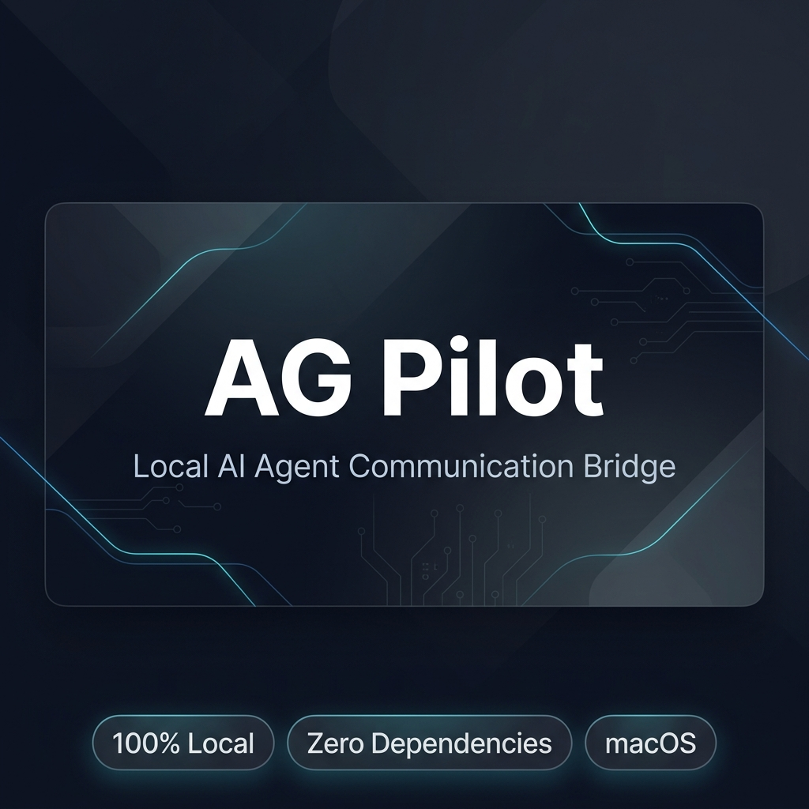

# AG Pilot

> Two AI agents on the same Mac. No copy-paste between them. Just local routing.

**English** | [中文](README-zh.md)

[](https://github.com/sefuzhou770801-hub/ag-pilot/actions)
[](#why)
[](#requirements)
[](LICENSE)




AG Pilot binds one Antigravity conversation to one Codex thread, then routes messages through CDP and local IPC. Zero dependencies. Zero cloud. Everything stays on your Mac.

## Why

When two agents collaborate, the fragile part is not the model — it is the human copy-paste loop.

AG Pilot kills that loop:

- **Group bindings** — each group owns one Antigravity conversation and one Codex thread, independently.
- **Real CDP selection** — Antigravity switches via actual mouse events, not brittle DOM hacks.
- **Safe routing** — messages go to the bound target, never the focused window.
- **Status lock** — Codex is marked busy on send, released on completion or timeout.
- **Telegram remote** — send messages, read replies, and check status from your phone.
- **Local by design** — no relay, no database, no secrets leaving the machine.

## Quick Start

```bash
git clone https://github.com/sefuzhou770801-hub/ag-pilot.git
cd ag-pilot
cp state.example.json state.json
./scripts/setup-cdp.sh          # enable Antigravity CDP
```

Restart Antigravity, then bind your first pair:

```bash
node bridge.mjs bind-ag --title "Your conversation title"
node bridge.mjs bind-codex 019xxxxxxxxxxxxxxxxxxxxxxxxxxxxx
node bridge.mjs status --json
```

Open the control card:

```bash
node server.mjs                 # http://127.0.0.1:4319
```

## Architecture

```
Human ──► Local Card (127.0.0.1:4319) ──► AG Pilot CLI + HTTP API
                                              │
                              ┌────────────────┼────────────────┐
                              ▼                ▼                ▼
                         state.json     CDP → Antigravity   IPC → Codex
                       (group bindings)  (port 9333)       (Unix socket)
```

One job: resolve the selected group, find the bound target, route through the right local channel.

## CLI

| Command | Purpose |
| --- | --- |
| `bridge.mjs status --json` | CDP, IPC, and routing state |
| `bridge.mjs bind-ag --title "T"` | Bind group to an Antigravity conversation |
| `bridge.mjs bind-codex 019...` | Bind group to a Codex thread |
| `bridge.mjs ag-list` | List visible Antigravity conversations |
| `bridge.mjs ag-send --text "msg"` | Send to bound Antigravity conversation |
| `bridge.mjs codex-send --text "msg"` | Send to bound Codex thread |
| `bridge.mjs ag-to-codex` | Forward latest Antigravity reply to Codex |
| `bridge.mjs codex-to-ag` | Forward latest Codex reply to Antigravity |

Add `--group "Name"` to target a specific group. Add `--dry-run` to preview without sending.

## HTTP API

Card service runs on `127.0.0.1:4319`.

| Endpoint | Purpose |
| --- | --- |
| `GET /api/snapshot` | Full card state, bindings, health |
| `GET /api/codex-threads` | Recent Codex threads from local DB |
| `POST /api/groups/create` | Create a group |
| `POST /api/groups/delete` | Delete a group |
| `POST /api/groups/switch` | Switch group + select Antigravity conversation |
| `POST /api/bind/ag` | Bind group to Antigravity title |
| `POST /api/bind/codex` | Bind group to Codex thread |
| `POST /api/open-codex` | Open bound Codex thread |

## Telegram Remote Control

Control AG Pilot from your phone.

```bash
AG_TELEGRAM_TOKEN="token" AG_TELEGRAM_CHAT_ID="id" node telegram-bot.mjs
```

| Command | What it does |
| --- | --- |
| *(plain text)* | Send directly to Antigravity, auto-push reply |
| `/status` | CDP, group, binding, busy state |
| `/list` | Numbered conversation list |
| `/use <n>` | Switch active conversation |
| `/read` | Latest Antigravity reply |
| `/peek` | Screenshot of Antigravity |
| `/pause` / `/resume` | Pause/resume message routing |
| `/stop` | Stop Antigravity agent (requires confirm) |
| `/help` | All commands |

Setup: create a bot via [@BotFather](https://t.me/BotFather), get your chat ID from [@userinfobot](https://t.me/userinfobot).

## Configuration

### CDP Port

```bash
./scripts/setup-cdp.sh                    # default 9333
AG_CDP_PORT=9444 ./scripts/setup-cdp.sh   # custom port
```

Port resolution order: `AG_CDP_PORT` env → `state.json` cdpPort → default 9333.

### State File

Bindings live in `state.json` (git-ignored):

```json
{
  "groups": [{
    "name": "Open Source",
    "agTitle": "My Antigravity Conversation",
    "codexThreadId": "019..."
  }]
}
```

## Requirements

- macOS
- Node.js 22+
- Antigravity with CDP enabled
- Codex App signed in on the same Mac

## Development

```bash
npm test          # 72 tests
npm run lint      # eslint
node server.mjs   # local card
```

## Safety

- Only talks to local CDP and local IPC. No network calls except Telegram (opt-in).
- Bindings are explicit. Missing target = command fails.
- State and logs are git-ignored.
- Card is localhost-only.

## Contributing

See [CONTRIBUTING.md](CONTRIBUTING.md). Issues and PRs welcome.

## License

[MIT](LICENSE)
