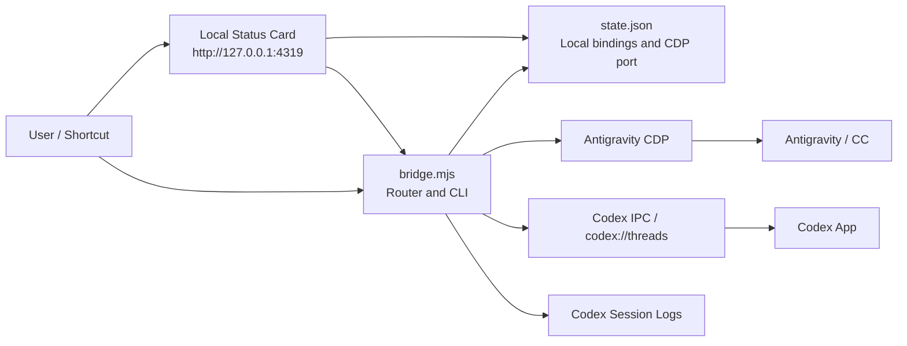

# CC-Codex Bridge

> Let two local AI tools pass messages without turning you into the clipboard.

CC-Codex Bridge connects an Antigravity conversation and a Codex App thread on the same Mac. It is designed for supervised local routing: you bind the two targets first, then the bridge can read the latest reply from one side and send it to the other.

## What It Does

- Reads the latest CC reply from a bound Antigravity conversation.
- Sends text to a bound Antigravity conversation through Chrome DevTools Protocol (CDP).
- Reads the latest assistant reply from a bound Codex thread.
- Sends text to a bound Codex App thread through the local Codex IPC socket.
- Supports multiple independent CC ↔ Codex groups.
- Provides a small local card at `http://127.0.0.1:4319` for checking bindings.

## Architecture



Everything runs locally. No cloud service is required.

## Requirements

- macOS
- Node.js 22 or newer
- Antigravity with CDP enabled
- Codex App signed in and able to open the target thread

## Enable Antigravity CDP

Run the setup script:

```bash
./scripts/setup-cdp.sh
```

The script updates:

```text
~/Library/Application Support/Antigravity/argv.json
```

It adds:

```json
{
  "remote-debugging-port": 9333
}
```

The original `argv.json` is backed up before the script writes changes. Restart Antigravity after running the script.

You can use another port:

```bash
AG_CDP_PORT=9444 ./scripts/setup-cdp.sh
```

## Quick Start

```bash
git clone https://github.com/sefuzhou770801-hub/cc-codex-bridge.git
cd cc-codex-bridge
cp state.example.json state.json
./scripts/setup-cdp.sh
```

Bind one Antigravity conversation and one Codex thread:

```bash
node bridge.mjs bind-cc --title "Antigravity conversation title"
node bridge.mjs bind-codex 019xxxxxxxxxxxxxxxxxxxxxxxxxxxxx
```

Open the local card:

```bash
./open-floating-card.sh
```

Install the card service:

```bash
./scripts/install-card-service.sh
```

After installation, the local card service starts on login and restarts if it exits.

## CDP Port Configuration

The bridge reads the Antigravity CDP port in this order:

1. `AG_CDP_PORT`
2. `cdpPort` in `state.json`
3. `autoAcceptV2.cdpPort` in Antigravity user settings, kept only as a compatibility fallback
4. `9333`

Example `state.json`:

```json
{
  "cdpPort": 9333
}
```

## CLI Reference

| Command | Purpose |
| --- | --- |
| `node bridge.mjs status --json` | Check Antigravity CDP, Codex IPC, and current bindings |
| `node bridge.mjs bind-cc --title "Title"` | Bind the active group to an Antigravity conversation |
| `node bridge.mjs bind-codex 019...` | Bind the active group to a Codex thread |
| `node bridge.mjs ag-list` | List Antigravity conversations visible through CDP |
| `node bridge.mjs ag-latest` | Read the latest reply from the bound Antigravity conversation |
| `node bridge.mjs ag-send --text "Message"` | Send text to the bound Antigravity conversation |
| `node bridge.mjs ag-send --group "Group name" --text "Message"` | Send text to a specific group's Antigravity conversation |
| `node bridge.mjs codex-latest` | Read the latest reply from the bound Codex thread |
| `node bridge.mjs codex-send --text "Message"` | Send text to the bound Codex thread |
| `node bridge.mjs codex-send --group "Group name" --text "Message"` | Send text to a specific group's Codex thread |
| `node bridge.mjs cc-to-codex` | Send the latest CC reply to Codex |
| `node bridge.mjs codex-to-cc` | Send the latest Codex reply back to CC |
| `node bridge.mjs cc-to-codex --dry-run` | Preview CC → Codex without sending |
| `node bridge.mjs codex-to-cc --dry-run` | Preview Codex → CC without sending |

## Groups

The local card can manage multiple bindings.

- Use `+` to create a group.
- Select a group before binding CC or Codex.
- The card's viewed group does not change the CLI's default send target.
- Use `--group` to target a specific group from the CLI.

Local state is stored in `state.json`. It may contain real conversation titles and Codex thread IDs, so it is ignored by Git.

## Tests

```bash
node --test test/*.test.mjs
```

## Safety Boundaries

- `state.json`, logs, and local runtime state are not committed.
- The bridge never guesses a target. Bindings must be explicit.
- Communication stays on the local machine.
- If Antigravity CDP or Codex IPC is unavailable, commands fail instead of sending to an unknown target.

## Troubleshooting

### `status` says Antigravity CDP is not connected

Run `./scripts/setup-cdp.sh`, restart Antigravity, then run:

```bash
node bridge.mjs status --json
```

### I changed the CDP port

Use the same port in both places:

```bash
AG_CDP_PORT=9444 ./scripts/setup-cdp.sh
AG_CDP_PORT=9444 node bridge.mjs status --json
```
