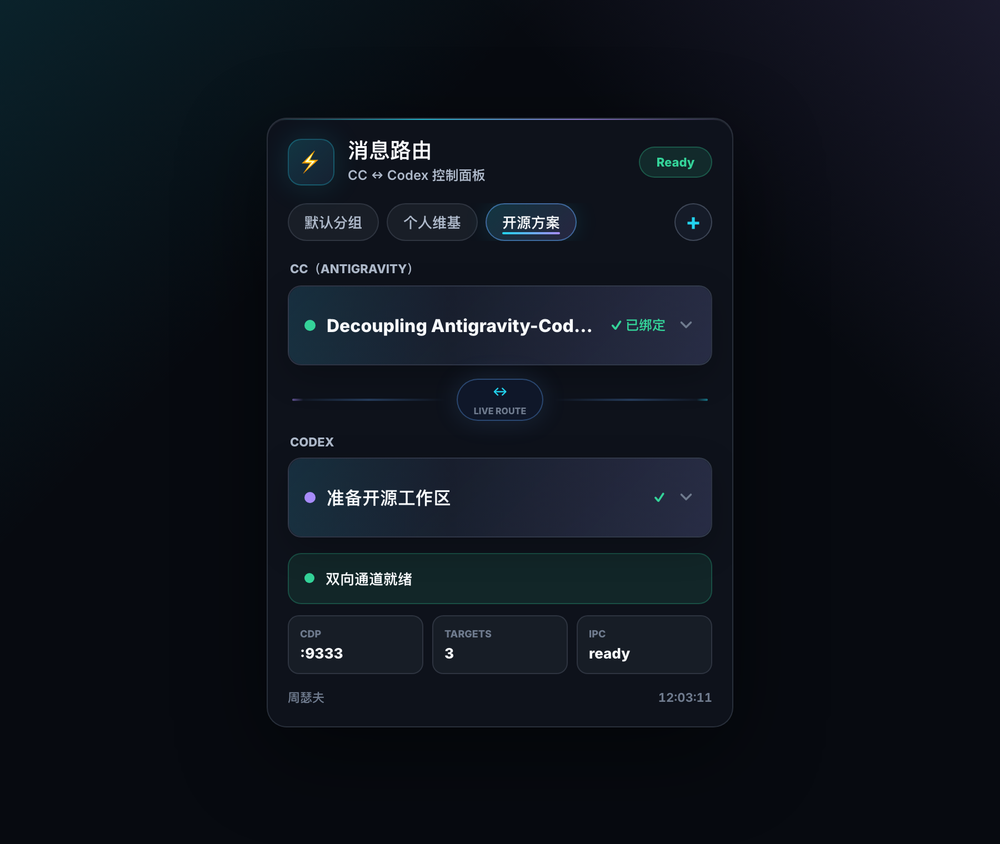
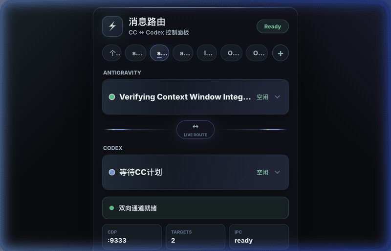
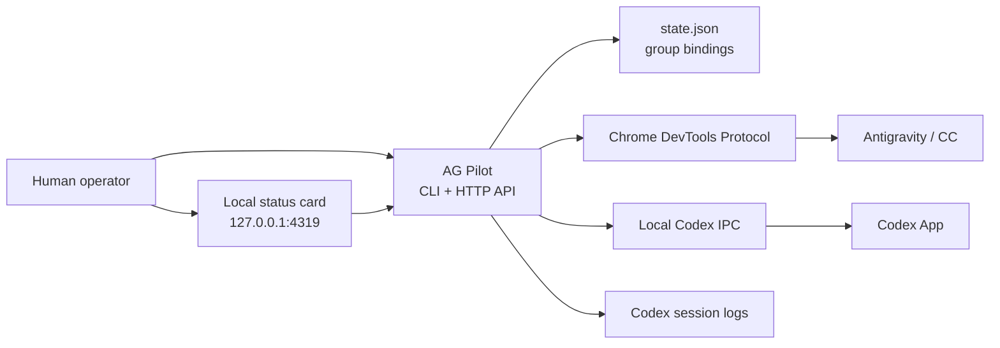

# AG Pilot

> Let Antigravity and Codex talk to each other. No copy. No paste. Just supervised local routing.

**English** | [中文](README-zh.md)

[](#why-bridge)
[](#requirements)
[](LICENSE)

AG Pilot is an **AI agent communication bridge** for people who run Antigravity and Codex side by side. Bind one Antigravity conversation to one Codex thread, then route messages through CDP and local IPC without using the clipboard as middleware.

## Demo





Click a group tab in the local card and both sides follow the binding:

- Antigravity Agent Manager selects the bound CC conversation through real CDP mouse events.
- Codex opens the bound thread through the local Codex IPC socket.
- The card keeps showing the fixed group binding instead of whichever window happens to be focused.

## Why Bridge

When two agents collaborate, the fragile part is not the model. It is the human copy-paste loop.

AG Pilot turns that loop into a small local control plane:

- **Explicit group bindings**: each group owns one CC conversation and one Codex thread.
- **Real Antigravity selection**: CDP sends actual mouse events, not brittle DOM clicks.
- **Safe routing**: send and read from the bound target, not the currently focused window.
- **Live status card**: see CDP, Codex IPC, bindings, and routing health at a glance.
- **Status lock**: Codex is automatically marked busy when executing; released on completion or timeout.
- **Local by design**: no hosted relay, no cloud database, no shared secret leaving the Mac.

## Quick Start

```bash
git clone https://github.com/sefuzhou770801-hub/ag-pilot.git
cd ag-pilot
cp state.example.json state.json
./scripts/setup-cdp.sh
```

Restart Antigravity after enabling CDP, then bind your first pair:

```bash
node bridge.mjs bind-cc --title "Antigravity conversation title"
node bridge.mjs bind-codex 019xxxxxxxxxxxxxxxxxxxxxxxxxxxxx
node bridge.mjs status --json
```

Open the control card:

```bash
node server.mjs
open http://127.0.0.1:4319
```

Install the login service if you want the card to run in the background:

```bash
./scripts/install-card-service.sh
```

## Architecture



The bridge has one job: resolve the selected group, find the bound target, then send or read through the right local channel.

## Features

| Feature | What it gives you |
| --- | --- |
| Group binding | Keep multiple CC/Codex pairs independent: personal wiki, open-source work, QA, and more. |
| Bound-target routing | Commands use the group's saved CC title and Codex thread ID instead of the active window. |
| CDP real click | Antigravity selection uses real mouse events so the app framework sees the interaction. |
| Codex IPC open/send | Open and send to Codex threads through the local desktop IPC socket. |
| Status card | A polished local dashboard for bindings, health, and quick group switching. |
| Status lock | Codex is automatically marked busy on send, released on completion or timeout. The card shows execution state in real time. |
| Safe failure mode | If a target is missing, the command fails instead of guessing where to send. |

## Configuration

### Antigravity CDP

Run:

```bash
./scripts/setup-cdp.sh
```

The script writes the CDP setting to:

```text
~/.antigravity/argv.json
```

Default port:

```text
9333
```

Use another port:

```bash
AG_CDP_PORT=9444 ./scripts/setup-cdp.sh
AG_CDP_PORT=9444 node bridge.mjs status --json
```

### State File

Runtime bindings live in `state.json`:

```json
{
  "groups": [
    {
      "name": "Open Source",
      "ccTitle": "Decoupling Antigravity-Codex Bridge",
      "codexThreadId": "019..."
    }
  ],
  "viewGroupId": "...",
  "cdpPort": 9333
}
```

`state.json` is ignored by Git because it contains local conversation titles and thread IDs.

### CDP Port Resolution

The bridge reads the Antigravity CDP port in this order:

1. `AG_CDP_PORT` environment variable
2. `cdpPort` in `state.json`
3. Default `9333`

## CLI Reference

| Command | Purpose |
| --- | --- |
| `node bridge.mjs status --json` | Check CDP, Codex IPC, and current routing state. |
| `node bridge.mjs bind-cc --title "Title"` | Bind the viewed group to an Antigravity conversation. |
| `node bridge.mjs bind-codex 019...` | Bind the viewed group to a Codex thread. |
| `node bridge.mjs ag-list` | List Antigravity conversations visible through CDP. |
| `node bridge.mjs ag-latest` | Read the latest reply from the bound CC conversation. |
| `node bridge.mjs ag-send --text "Message"` | Send text to the bound CC conversation. |
| `node bridge.mjs ag-send --group "Open Source" --text "Message"` | Send text to a specific group's CC conversation. |
| `node bridge.mjs codex-latest` | Read the latest assistant reply from the bound Codex thread. |
| `node bridge.mjs codex-send --text "Message"` | Send text to the bound Codex thread. |
| `node bridge.mjs codex-send --group "Open Source" --text "Message"` | Send text to a specific group's Codex thread. |
| `node bridge.mjs cc-to-codex` | Send the latest CC reply to Codex. |
| `node bridge.mjs codex-to-cc` | Send the latest Codex reply back to CC. |
| `node bridge.mjs cc-to-codex --dry-run` | Preview CC to Codex without sending. |
| `node bridge.mjs codex-to-cc --dry-run` | Preview Codex to CC without sending. |

## HTTP API

The card service runs on `127.0.0.1:4319` by default.

| Endpoint | Purpose |
| --- | --- |
| `GET /api/snapshot` | Return card state, bindings, conversations, Codex threads, and health. |
| `GET /api/codex-threads` | List recent Codex threads from the local Codex database. |
| `POST /api/groups/create` | Create a group. |
| `POST /api/groups/delete` | Delete a group. |
| `POST /api/groups/switch` | Switch the viewed group and select its bound Antigravity conversation. |
| `POST /api/bind/cc` | Bind the viewed group to a CC conversation title. |
| `POST /api/bind/codex` | Bind the viewed group to a Codex thread ID. |
| `POST /api/open-codex` | Open the viewed group's Codex thread. |

## Requirements

- macOS
- Node.js 22 or newer
- Antigravity with CDP enabled
- Codex App signed in on the same Mac

## Development

Run the test suite:

```bash
node --test test/*.test.mjs
```

Run the local card:

```bash
node server.mjs
open http://127.0.0.1:4319
```

## Safety

- The bridge only talks to local Antigravity CDP and local Codex IPC.
- Bindings are explicit. If a group has no target, sending fails.
- Local state and logs are not committed.
- The card is served on localhost only.

## Contributing

Issues and pull requests are welcome. Please include:

- the command or card action you used,
- what you expected to happen,
- what actually happened,
- whether `node bridge.mjs status --json` reports CDP and IPC as connected.

## License

MIT. See [LICENSE](LICENSE).
