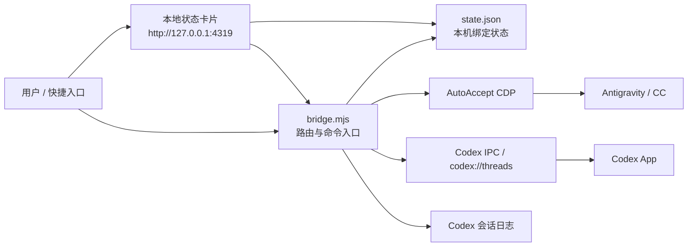

# CC-Codex Bridge

> 让两个 AI 自己传话，老板不再当人肉传送带。

把 Antigravity 里的 CC 和 Codex App 连起来的本地桥接器。目标很简单：少复制粘贴，让两个 AI 在你确认的对话之间传话。

## 能做什么

- 从 Antigravity 读取 CC 最后一条回复，发送到指定 Codex 对话。
- 从 Codex 对话读取最新回复，发送回指定 Antigravity 对话。
- 支持多组绑定，每组是一条独立的 CC ↔ Codex 通道。
- 提供 macOS 风格的本地卡片，显示当前活跃分组和绑定状态。
- `ag-send` 发送到 Antigravity 失败时会自动重试一次，减少 CDP 短暂抖动造成的失败。

## 架构



桥接器只保存在本机运行，不需要云端服务。Antigravity 侧依赖 AutoAccept 暴露的本地 CDP 能力；Codex 侧依赖本机 IPC、`codex://threads/<threadId>` 和 Codex 会话日志。

## 环境要求

- macOS
- Node.js 22 或更高版本
- Antigravity 已安装 AutoAccept 插件
- Codex App 已登录并能打开目标对话
- 本机允许访问 AutoAccept 的 CDP 端口

## 快速开始

```bash
git clone https://github.com/sefuzhou770801-hub/cc-codex-bridge.git
cd cc-codex-bridge
cp state.example.json state.json
```

先绑定一个 Antigravity 对话和一个 Codex 对话：

```bash
node bridge.mjs bind-cc --title "Antigravity 对话标题"
node bridge.mjs bind-codex 019xxxxxxxxxxxxxxxxxxxxxxxxxxxxx
```

打开状态卡片：

```bash
./open-floating-card.sh
```

卡片地址：

```text
http://127.0.0.1:4319/
```

安装后台服务：

```bash
./scripts/install-card-service.sh
```

安装后，卡片服务会在登录时自动启动；进程退出后也会被 macOS 自动拉起。

## CLI 速查表

| 命令 | 用途 |
| --- | --- |
| `node bridge.mjs status --json` | 查看 AutoAccept、Codex IPC 和绑定状态 |
| `node bridge.mjs bind-cc --title "标题"` | 把当前活跃分组绑定到指定 Antigravity 对话 |
| `node bridge.mjs bind-codex 019...` | 把当前活跃分组绑定到指定 Codex 对话 |
| `node bridge.mjs ag-list` | 列出 AutoAccept 能看到的 Antigravity 对话 |
| `node bridge.mjs ag-latest` | 读取绑定 CC 对话的最新回复 |
| `node bridge.mjs ag-send --text "消息"` | 向绑定 CC 对话发送消息，失败会自动重试一次 |
| `node bridge.mjs ag-send --group "分组名" --text "消息"` | 向指定分组绑定的 CC 对话发送消息 |
| `node bridge.mjs codex-latest` | 读取绑定 Codex 对话的最新回复 |
| `node bridge.mjs codex-send --text "消息"` | 向绑定 Codex 对话发送消息 |
| `node bridge.mjs codex-send --group "分组名" --text "消息"` | 向指定分组绑定的 Codex 对话发送消息 |
| `node bridge.mjs cc-to-codex` | 把 CC 最新回复发送到 Codex |
| `node bridge.mjs codex-to-cc` | 把 Codex 最新回复发送回 CC |
| `node bridge.mjs cc-to-codex --dry-run` | 只预览 CC → Codex，不发送 |
| `node bridge.mjs codex-to-cc --dry-run` | 只预览 Codex → CC，不发送 |

## 多组绑定

状态卡片顶部会显示所有分组。

- 点 `+` 创建新分组。
- 点分组名切换当前活跃分组。
- CC 和 Codex 的绑定只作用于当前活跃分组。
- 主 CLI 不带 `--group` 时操作 CLI 活跃分组；带 `--group` 时操作指定分组。
- 卡片切换分组只影响前端正在查看的分组，不会改变 CLI 默认发送目标。

本机状态保存在 `state.json`。这个文件可能包含你的真实对话标题和 Codex 对话 ID，默认不会提交到 Git。

## 测试

```bash
node --test test/*.test.mjs
```

## 安全边界

- `state.json`、日志文件和本机运行状态不会进入仓库。
- 桥接器不会自动猜目标窗口，必须先绑定目标。
- 所有通信发生在本机。
- 如果 AutoAccept 或 Codex IPC 不可用，命令会失败，不会静默发送到未知目标。

## 常见问题

### 发送到 Antigravity 偶尔失败怎么办？

`ag-send` 会自动重试一次。第一次失败后等待 3 秒，第二次仍失败才返回错误。JSON 输出里会带 `retried: true`，方便上层脚本判断。

### 为什么 Codex 对话要显示标题？

Codex 对话 ID 很难人工判断。卡片会优先从本机 Codex 数据库读取中文标题，读不到时才显示缩短后的对话 ID。

### 为什么不直接依赖云端 webhook？

这个工具的目标是降低本机双窗口工作流的摩擦。核心路径在本机完成，延迟更低，也不会把对话内容发到额外服务器。
